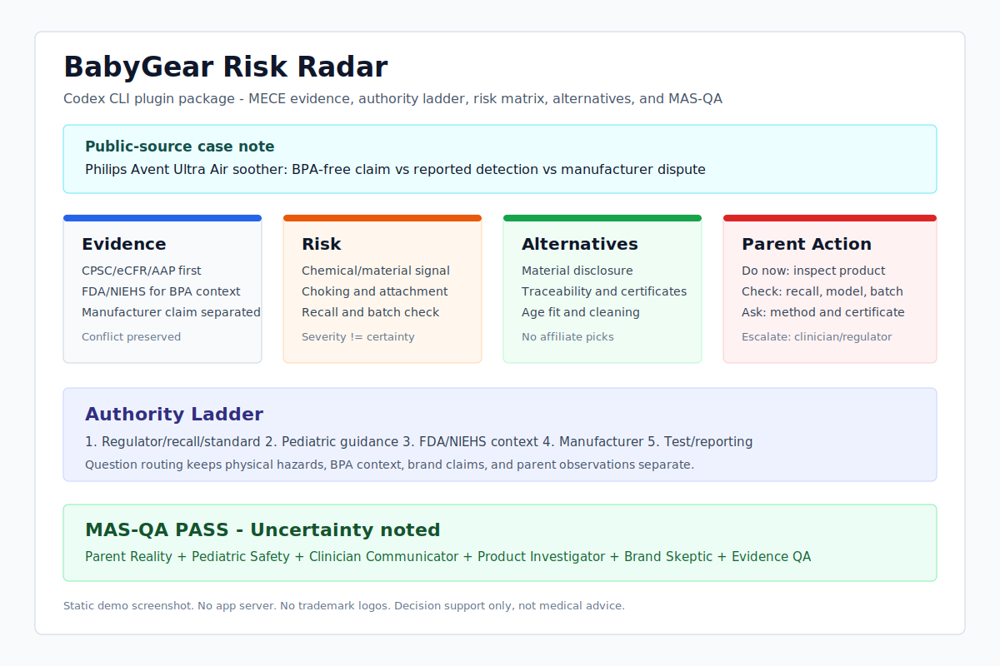

# BabyGear Risk Radar Codex Plugin

BabyGear Risk Radar is a Codex plugin that helps parents and builders evaluate baby-product safety claims using MECE evidence mapping, risk reasoning, brand-claim skepticism, alternative criteria, and MAS-QA. It was built for a 90-minute mini-Ralphthon after the Philips Avent pacifier BPA controversy showed that trusted-brand claims, consumer-test reports, manufacturer responses, and regulatory context can conflict in a real purchase decision.



The screenshot is a static demo of the plugin workflow, not an app UI. It shows how Codex should separate evidence, risk, alternatives, parent action, official source hierarchy, and MAS-QA.

## What Problem It Solves

Parents often have to decide before evidence is perfectly resolved. A famous brand, a "BPA-free" claim, a public article, a manufacturer response, and regulator guidance may all point in different directions. This plugin makes Codex separate those claims instead of collapsing them into fear or false certainty.

## Plugin Structure

```text
.
├── .codex-plugin/plugin.json
├── skills/babygear-risk-radar/SKILL.md
├── .agents/plugins/marketplace.json
├── assets/demo-screenshot.svg
├── examples/avent-pacifier-risk-brief.md
├── examples/sample-output.md
├── scripts/validate-plugin.ps1
├── docs/AUTHORITY_SOURCE_MAP.md
├── docs/MAS_ROUNDS.md
├── docs/OPERATION_NOTES.md
├── docs/SUBMISSION_CHECKLIST.md
├── scripts/Show-SubmissionSummary.ps1
├── reports/MAS_QA_REPORT.md
└── reports/FINAL_REPORT.md
```

## Install From Local Marketplace

The repository-scoped marketplace points to the root plugin path:

```json
{
  "name": "babygear-risk-radar",
  "source": {
    "source": "local",
    "path": "./"
  }
}
```

In a Codex environment that supports repo marketplaces, install or enable the plugin from `.agents/plugins/marketplace.json`.

## Usage Prompt Examples

```text
Use BabyGear Risk Radar to evaluate this pacifier safety concern.
```

```text
Create a MECE evidence map and parent action card for this baby product.
```

```text
Run MAS-QA on these baby-product safety claims and separate manufacturer claims from regulator guidance.
```

## Authority Source Map

The skill now uses a documented source ladder in `docs/AUTHORITY_SOURCE_MAP.md`. It prioritizes official product-safety and health sources such as CPSC/eCFR for pacifier physical requirements, CPSC recalls and SaferProducts.gov for product-specific signals, AAP/HealthyChildren for parent-use cautions, and FDA/NIEHS for BPA context. Manufacturer claims, consumer tests, journalism, and anecdotes are handled as lower or more limited evidence tiers.

`docs/MAS_ROUNDS.md` records the MAS debate discipline: odd rounds are visionary and parent-value oriented; even rounds are critical and check for overclaiming, source gaps, medical boundaries, and false certainty.

## Validation

Run from the repository root in PowerShell 7:

```powershell
pwsh -NoProfile -File .\scripts\validate-plugin.ps1
```

Adjacent regression check:

```powershell
pwsh -NoProfile -File .\plugins\parentpick-guard\scripts\Test-ParentPickGuard.ps1
```

Submission summary:

```powershell
pwsh -NoProfile -File .\scripts\Show-SubmissionSummary.ps1
```

## GitHub Submission URL

https://github.com/procloudkim/2026-06-07-harness-baby

Preferred target repository name was `babygear-risk-radar-codex-plugin`. The local machine does not have GitHub CLI (`gh`) installed, so a new repository could not be created automatically. The committed submission was pushed to the user-provided public origin above.

## Known Limitations

- This package has no hooks, MCP server, app connector, backend, telemetry, or external API dependency.
- The demo case is a public-source case note, not a live recall lookup.
- It does not scrape YouTube or medical websites.
- It does not recommend affiliate products.
- It cannot determine product safety without current authoritative evidence from the user or official sources.

## Safety Disclaimer

BabyGear Risk Radar is decision support, not medical advice. For symptoms, urgent concerns, recalls, product breakage, or uncertainty involving a newborn or infant, consult a pediatrician, clinician, regulator, or official recall channel.

## Privacy

The plugin package stores no user data and ships no telemetry. Local examples and reports are static repository artifacts.

## Terms

Use this package as a local Codex workflow aid. It does not replace professional medical, legal, regulatory, or product-safety advice.
